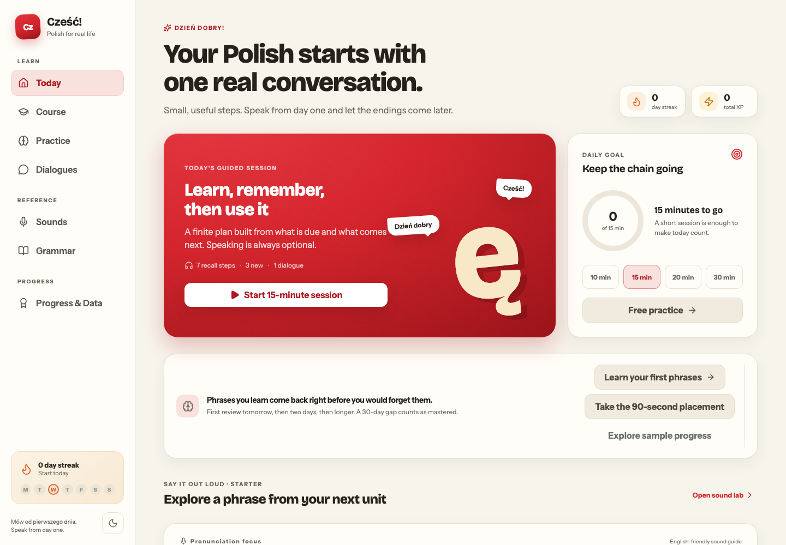
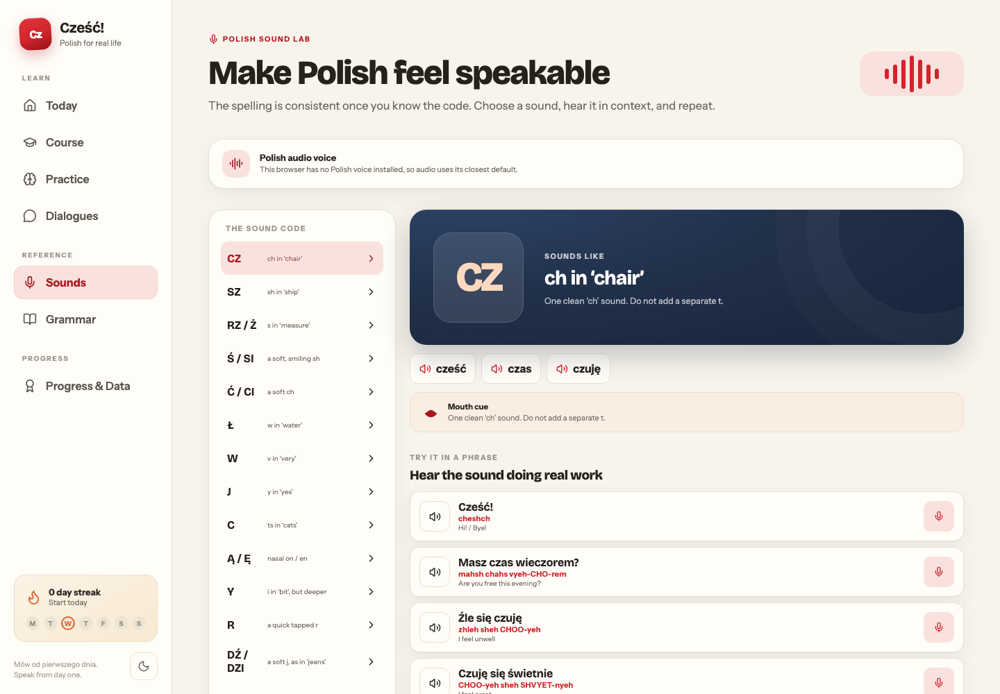
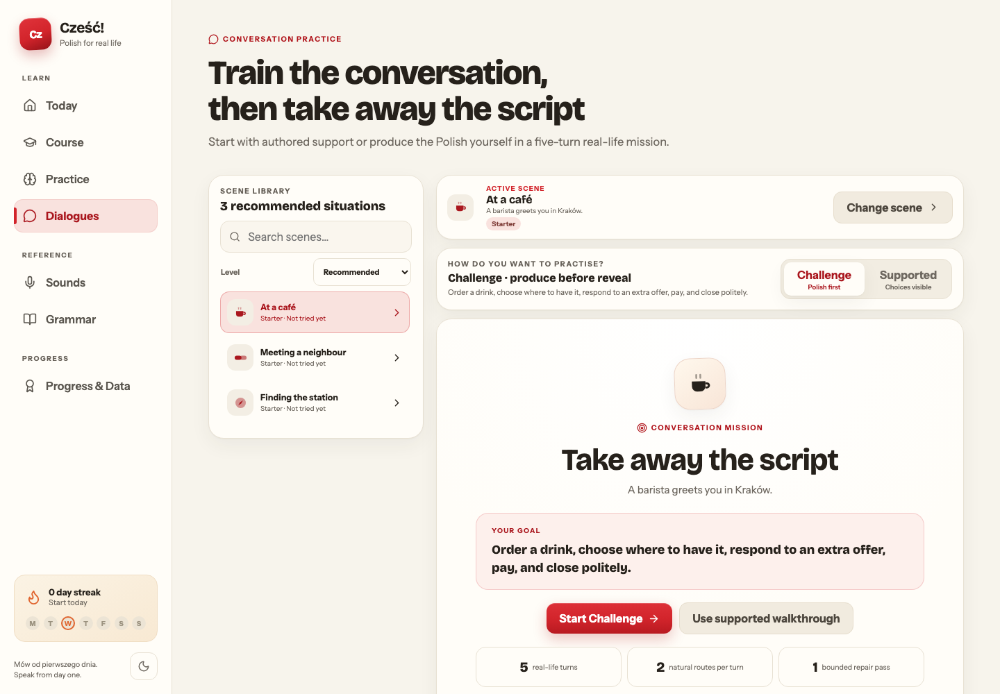
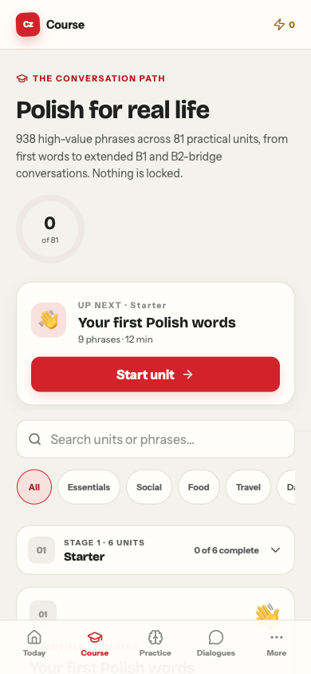
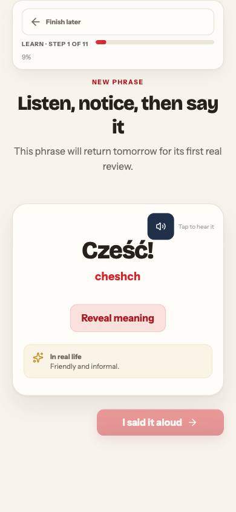

# Cześć! — Polish for real life

**A pronunciation-first, local-first Polish course that turns useful phrases into real conversations.** It starts with complete-beginner survival language, builds towards confident B1 communication, and continues into a practical B2 bridge.

[**Try the live course →**](https://peterlp123.github.io/polish-first/) · [Explore the design system](docs/design.md)

[](https://github.com/PeterLP123/polish-first/actions/workflows/quality.yml)
[](https://github.com/PeterLP123/polish-first/actions/workflows/deploy-pages.yml)
[](https://react.dev/)



## Why this project

Most beginner resources separate vocabulary, grammar, pronunciation, and speaking. Cześć brings them into one finite daily loop: learn a useful phrase, hear it, recall it at the right time, and use it in a realistic conversation.

The app has no account system or external backend. Progress stays in the browser, the installed course works offline after the first visit, and microphone practice remains optional.

## Product proof

| Curriculum | Practice | Progress |
| --- | --- | --- |
| 81 conversation-led units | 42 supported scenes + production-first missions | Due-date spaced repetition |
| 938 useful words and phrases | 24 Polish sound lessons | Finite guided daily sessions |
| 66 grammar explainers | 36 readings + 36 writing tasks | XP, streaks, goals, and mastery |
| Beginner survival Polish → B2 bridge | Focus Review plus flashcard, listening, building, speaking, reading, writing, and grammar modes | 10 multi-skill stage checks |

## What makes it useful

- **Speak from day one.** Every phrase combines browser-spoken Polish audio with an English-friendly pronunciation guide.
- **Practise without perfect hardware.** Microphone recognition is optional; phone dictation and self-report fallbacks keep speaking work available across browsers.
- **Review what is actually weak.** Again, Hard, Good, and Easy ratings schedule due reviews and prioritise weaker phrases.
- **Repair weak spots without an endless feed.** Focus Review gives up to ten English-to-Polish retrievals, then offers one bounded repair pass for Hard and Again phrases.
- **Move from recall to conversation.** Every five-turn scene has a supported walkthrough and a production-first mission with staged hints, two authored natural responses per turn, and one bounded repair pass.
- **Keep sessions finishable.** Daily plans interleave due reviews with new language, explain adaptive choices, and still finish with one real-life dialogue.
- **Own your progress.** Learning data stays in `localStorage` and can be validated, exported, and imported.

## Inside the course

<table>
  <tr>
    <td width="50%">
      
      <br><strong>Sound Lab</strong> — focused pronunciation and minimal-pair listening.
    </td>
    <td width="50%">
      
      <br><strong>Conversation Missions</strong> — practical scenes that move from visible support to Polish-first production.
    </td>
  </tr>
  <tr>
    <td width="50%">
      
      <br><strong>Course map</strong> — 81 searchable units from first words to a B2 bridge.
    </td>
    <td width="50%">
      
      <br><strong>Guided sessions</strong> — a clear, finite plan for each day.
    </td>
  </tr>
</table>

## Engineering highlights

- React and Vite single-page application with a hand-built component and token-based design system
- Installable PWA with offline caching, update prompts, self-hosted fonts, and no runtime CDN dependency
- Content schemas and generated catalogues for phrases, dialogues, readings, writing tasks, grammar guides, and milestones
- Browser speech synthesis with persisted Polish voice selection and graceful recognition fallbacks
- Versioned learning-state migrations plus validated progress export and import
- Derived focus queues and adaptive session sequencing without adding fields to the saved-progress contract
- Responsive desktop, tablet, and mobile layouts with light and dark themes
- Keyboard drill controls, Polish diacritic entry helpers, visible focus states, and reduced-motion support
- Vitest component and domain tests, Playwright functional journeys, and desktop/mobile visual regression coverage

The visual identity draws on the Polish School of Posters: poster crimson, granat navy, warm paper, bold display type, and restrained print grain. Its tokens and contribution conventions are documented in [docs/design.md](docs/design.md).

## Project structure

```text
src/components/       Learning views and reusable interface components
src/data/content/     Schema-checked curriculum and activity content
src/lib/              Learning, navigation, speech, storage, and theme logic
public/               PWA manifest, icons, and service worker
e2e/                  Functional and visual Playwright coverage
docs/                 Design-system documentation and portfolio assets
```

## Run locally

Requires Node.js 22 or later.

```bash
git clone https://github.com/PeterLP123/polish-first.git
cd polish-first
npm ci
npm run dev
```

Open the address Vite prints, normally [http://localhost:5173](http://localhost:5173).

## Quality checks

```bash
npm test
npm run build
npm run test:e2e
```

Pushes and pull requests run unit tests, a production build, and functional browser tests. Pushes to `main` deploy automatically to GitHub Pages.

Chrome and Edge provide the broadest microphone speech-recognition support. Audio playback and all non-microphone modes work in other current browsers.

## Project status

Cześć is an actively developed personal portfolio project. Its source is public for review and learning, but no licence for reuse or redistribution is currently granted.
